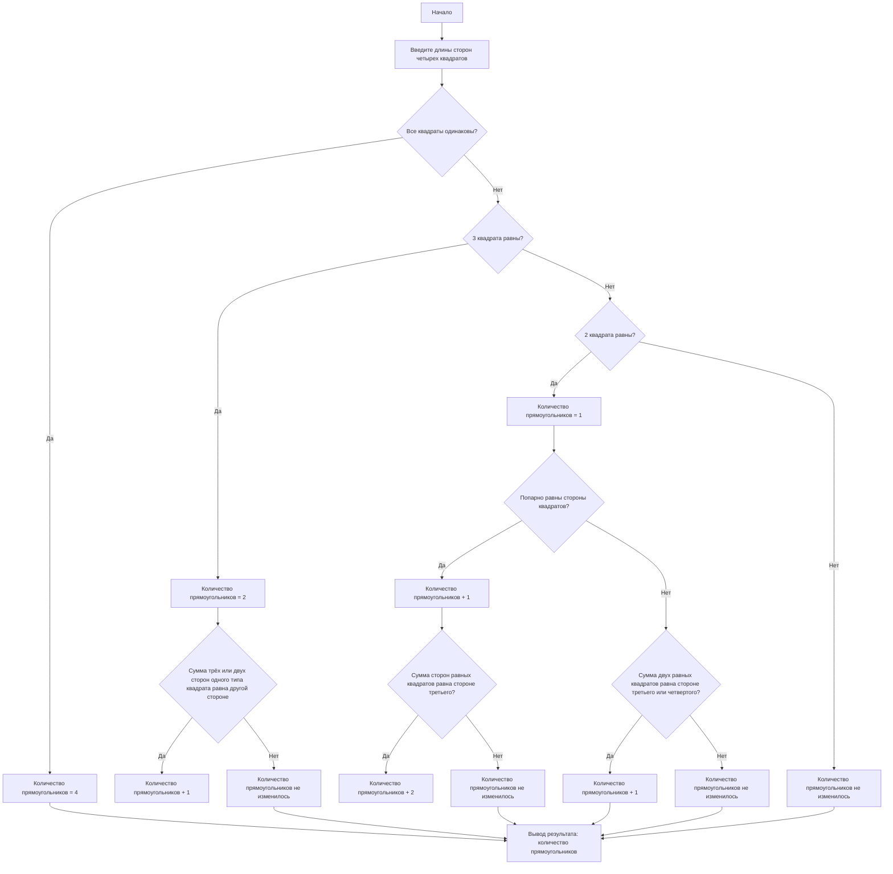

## Отчет по лабораторной работе № 1

#### № группы: `ПМ-2402`

#### Выполнил: `Киблицкий Ян Денисович`

#### Вариант: `11`

### Cодержание:

- [Постановка задачи](#1-постановка-задачи)
- [Входные и выходные данные](#2-входные-и-выходные-данные)
- [Выбор структуры данных](#3-выбор-структуры-данных)
- [Алгоритм](#4-алгоритм)
- [Программа](#5-программа)
- [Анализ правильности решения](#6-анализ-правильности-решения)

### 1. Постановка задачи

> Программа получает на вход четыре различных квадрата с длинами сторон \( A, B, C, D \). Необходимо определить, сколько можно составить прямоугольников, используя хотя бы два квадрата, без наложений и зазоров.

Данную задачу можно разделить на 3 подзадачи: все квадраты одинаковые, 3 квадрата одинаковые и только 2.

- Для 1 подзадачи нужно рассмотреть 1 случай:
    1. все квадраты одинаковы, тогда из них можно сложить только 4 прямоугольника  
- Для 2 подзадачи нам нужно рассмотреть 3 случая
    1. сумма 3 сторон квадратов равна четвертому  
    2. сумма сторон 2х квадратов из 3 одинаковых равна стороне 4ому квадрату  
    3. стороны 3х квадратов одинаковы
- Для 3 подзадачи нам нужно рассмотреть 4 случая
    1. стороны 2х квадратов равны
    2. стороны 4х квадратов попарно равны
    3. сумма сторон 2х равных квадратов равна стороне третьего(третий равен четвертому)
    4. сумма сторон 2х равных квадратов равна стороне третьего/четвертого

### 2. Входные и выходные данные

#### Данные на вход

На вход программа должна получать 4 числа, при этом в условии не сказано, к какому множеству
принадлежать получаемые числа, поэтому будем считать их вещественными положительными (тк это стороны квадратов, а проверка на некорректные значения не требуется). 
Также даны верхняя и нижняя границы получаемых чисел.

|             | Тип                | min значение    | max значение   |
|-------------|--------------------|-----------------|----------------|
| A (Число 1) | Вещественное число |        >0       | 10<sup>9</sup> |
| B (Число 2) | Вещественное число |        >0       | 10<sup>9</sup> |
| C (Число 1) | Вещественное число |        >0       | 10<sup>9</sup> |
| D (Число 2) | Вещественное число |        >0       | 10<sup>9</sup> |

#### Данные на выход

Т.к. программа должна вывести количество прямоугольников, которые можно составить из данных квадратов, то на выход мы получим
единственное вещественное неотрицательное число, не превышающее 10<sup>9</sup>.

|            | Тип                                | min значение | max значение   |
|------------|------------------------------------|--------------|----------------|
| rectangles | Вещественное неотрицательное число |       0      | 10<sup>9</sup> |

### 3. Выбор структуры данных

Программа получает 4 вещественных числа, не превышающих по модулю 10<sup>9</sup> < 2<sup>30</sup>. Поэтому для их хранения
можно выделить 4 переменных (`A`, `B`, `C` и `D]) типа `double`.

|             | название переменной | Тип (в Java) | 
|-------------|---------------------|--------------|
| A (Число 1) | `A`                 | `double`     |
| B (Число 2) | `B`                 | `double`     | 
| C (Число 1) | `C`                 | `double`     |
| D (Число 2) | `D`                 | `double`     | 

### 4. Алгоритм

#### Алгоритм выполнения программы:

1. **Ввод данных:**  
   Программа считывает четыре вещественных положительных числа, обозначенные как `A`, `B`, `C` и `D`.

2. **Проверка всех возможных комбинаций квадратов для составления прямоугольников:**
  - Все квадраты одинаковы, тогда из них можно сложить 4 прямоугольника  
  - Сумма 3 сторон квадратов равна четвертому  
  - Сумма сторон 2х квадратов из 3 одинаковых равна стороне 4ому квадрату  
  - Стороны 3х квадратов одинаковы
  - Стороны 2х квадратов равны
  - Стороны 4х квадратов попарно равны
  - Сумма сторон 2х равных квадратов равна стороне третьего(третий равен четвертому)
  - Сумма сторон 2х равных квадратов равна стороне третьего/четвертого

3. **Вывод результата:**  
   На экран выводится количество прямоугольников, которое можно сложить из квадратов.

#### Блок-схема


### 5. Программа

```java
import java.util.Scanner;

public class Main {
    public static void main(String[] args) {
        Scanner scanner = new Scanner(System.in);
        // Ввод сторон квадратов
        System.out.println("Введите длины сторон четырех квадратов:");
        int A = scanner.nextInt();
        int B = scanner.nextInt();
        int C = scanner.nextInt();
        int D = scanner.nextInt();

        // Инициализируем переменную для подсчета прямоугольников
        int rectangles = 0;

        // Проверка, все квадраты равны
        if (A == B && B == C && C == D) {
            // Если все квадраты одинаковы, можно составить только 3 прямоугольника
            rectangles = 4;
        }
        // Проверка, 3 квадрата равны
        else if ((A == B && A == C) || (A == C && C == D) || (A == B && B == D) || (B == C && D == B)) {
            // Если три стороны равны, то устанавливаем количество прямоугольников = 2
            rectangles = 2;

            // Дополнительная проверка на комбинацию сторон для составления прямоугольника
            if (((A == B && A == C) && (A * 3 == D || A * 2 == D)) ||
                    ((A == C && C == D) && (A * 3 == B || A * 2 == B)) ||
                    ((A == B && B == D) && (A * 3 == C || A * 2 == C)) ||
                    ((B == C && D == B) && (B * 3 == A || 2 * B == A))) {
                // Если сумма трёх или двух сторон одного типа квадрата равна другой стороне
                rectangles += 1;
            }
        }
        // Проверка, когда 2 стороны равны
        else if (A == B || A == C || A == D || B == C || B == D || C == D) {
            // Если две стороны равны, количество прямоугольников = 1
            rectangles = 1;

            // Проверка попарного равенства сторон
            if ((A == B && C == D) || (A == C && B == D) || (A == D && B == C)) {
                // Если стороны квадратов попарно равны, увеличиваем количество прямоугольников на 1
                rectangles += 1;

                // Проверка, если сумма сторон двух равных квадратов равна стороне третьего квадрата
                if (((A == B && C == D && (A * 2 == C || C * 2 == A)) ||
                        ((A == C && B == D) && (A * 2 == B || B * 2 == A)) ||
                        ((A == D && B == C) && (A * 2 == B || B * 2 == A)))) {
                    // Если сумма сторон равных квадратов равна стороне третьего квадрата, добавляем ещё два прямоугольника
                    rectangles += 2;
                }
            } else if ((A == B && (A * 2 == C || A * 2 == D)) ||
                    (A == C && (A * 2 == B || A * 2 == D)) ||
                    (A == D && (A * 2 == B || A * 2 == C)) ||
                    (B == C && (B * 2 == A || B * 2 == D)) ||
                    (B == D && (B * 2 == A || B * 2 == C)) ||
                    (C == D && (C * 2 == A || C * 2 == B))) {
                // Если сумма двух равных квадратов равна стороне третьего или четвёртого квадрата, добавляем один прямоугольник
                rectangles += 1;
            }
        }

        // Вывод результата
        System.out.println("Можно сложить прямоугольников: " + rectangles);
    }
}

```

### 6. Анализ правильности решения

Программа работает корректно на всем множестве решений с учетом ограничений.

1. Тест на `Все квадраты одинаковы`:

    - **Input**:
        ```
        2 2 2 2
        ```

    - **Output**:
        ```
        4
        ```

2. Тест на `Сумма 3 сторон квадратов равна четвертому`:

    - **Input**:
        ```
        2 2 2 6
        ```

    - **Output**:
        ```
        3
        ```

3. Тест на `Сумма сторон 2х квадратов из 3 одинаковых = стороне 4ому квадрату`:

    - **Input**:
        ```
        2 2 2 4
        ```

    - **Output**:
        ```
        3
        ```

4. Тест на `Стороны 3х квадратов одинаковы(исключительно)`:

    - **Input**:
        ```
        2 2 2 10
        ```

    - **Output**:
        ```
        2
        ```

5. Тест на `Стороны 2х квадратов равны(исключительно)`:

    - **Input**:
        ```
        2 2 5 60
        ```

    - **Output**:
        ```
        1
        ```

6. Тест на `Стороны 4х квадратов попарно равны`:

    - **Input**:
        ```
        2 2 10 10
        ```

    - **Output**:
        ```
        2
        ```

7. Тест на `Сумма сторон 2х равных квадратов равна стороне третьего(третий равен четвертому)`:

    - **Input**:
        ```
        2 2 4 4
        ```

    - **Output**:
        ```
        4
        ```

8. Тест на `Сумма сторон 2х равных квадратов равна стороне третьего/четвертого`:

    - **Input**:
        ```
        2 2 4 9 
        ```

    - **Output**:
        ```
        2
        ```
        
